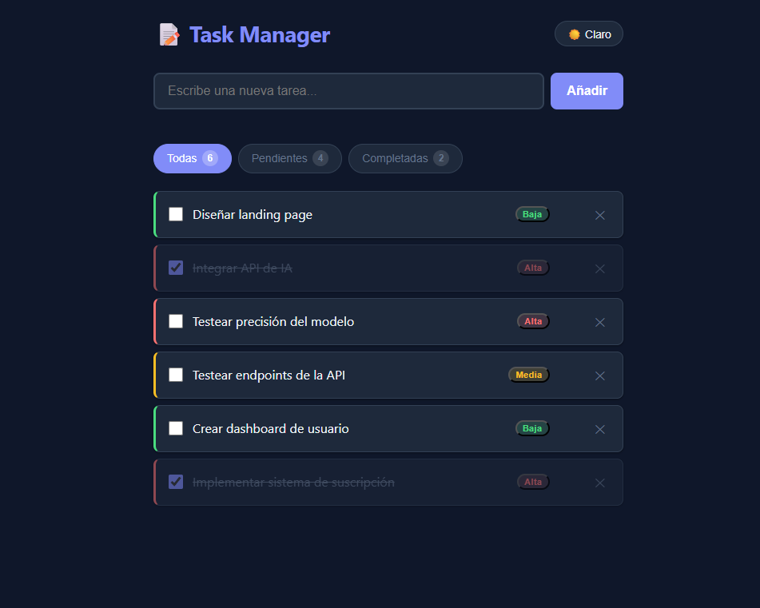

# 📝 Task Manager

Una aplicación de gestión de tareas construida con React. Proyecto desarrollado para practicar y consolidar fundamentos de React, gestión de estado y diseño de componentes.



## 🚀 Demo en vivo

[Ver aplicación desplegada →](https://adridiaz23.github.io/task-manager)

---

## ✨ Funcionalidades

- **Crear tareas** con validación de longitud mínima y máxima
- **Editar tareas** con doble clic o botón, confirmando con Enter o cancelando con Escape
- **Eliminar tareas** individualmente
- **Marcar como completadas** con checkbox
- **Filtrar** por estado: todas / pendientes / completadas
- **Prioridades** (alta, media, baja) con badge de color y borde visual
- **Modo oscuro** con toggle manual, persistido en localStorage
- **Datos persistentes** entre sesiones gracias a localStorage
- **Diseño responsive** para móvil y escritorio

---

## 🛠️ Stack tecnológico

| Tecnología | Versión | Uso |
|---|---|---|
| React | 18 | Librería de UI |
| Vite | 5 | Bundler y servidor de desarrollo |
| JavaScript (ES6+) | — | Lógica de la aplicación |
| CSS3 | — | Estilos y modo oscuro con custom properties |

Sin librerías externas de UI ni gestión de estado. Todo construido con React puro.

---

## 📁 Estructura del proyecto

src/
├── main.jsx              # Punto de entrada — monta la app en el DOM
├── App.jsx               # Componente raíz — estado global y lógica principal
├── index.css             # Variables CSS, reset y estilos globales
└── components/
├── TaskForm.jsx       # Formulario para añadir tareas (con validación)
├── FilterBar.jsx      # Botones de filtro con contadores
├── TaskList.jsx       # Lista de tareas + estados vacíos
└── TaskItem.jsx       # Tarea individual con edición inline y prioridades

---

## ⚙️ Cómo ejecutar el proyecto localmente

**Requisitos previos:** Node.js 18 o superior

```bash
# 1. Clonar el repositorio
git clone https://github.com/TU-USUARIO/task-manager.git
cd task-manager

# 2. Instalar dependencias
npm install

# 3. Arrancar el servidor de desarrollo
npm run dev
```

Abre [http://localhost:5173](http://localhost:5173) en tu navegador.

```bash
# Otros comandos disponibles
npm run build    # Genera la versión de producción en /dist
npm run preview  # Previsualiza la versión de producción localmente
```

---

## 🧱 Cómo funciona el código — conceptos clave

### Flujo de datos unidireccional

En React los datos fluyen en una sola dirección: de padre a hijo via **props**. Nunca al revés. Cuando un componente hijo necesita cambiar algo (añadir, borrar, editar una tarea), no lo hace directamente: llama a una función que le pasó el padre.

App (tiene el estado)
├── TaskForm    ← recibe onAdd()
├── FilterBar   ← recibe onFilterChange()
└── TaskList
└── TaskItem  ← recibe onToggle(), onDelete(), onEdit(), onPriorityChange()

### Estado en App.jsx

`App.jsx` es la única fuente de verdad. Todos los datos viven aquí:

```jsx
const [tasks,  setTasks]  = useState([])   // array de tareas
const [filter, setFilter] = useState('all') // filtro activo
const [darkMode, setDarkMode] = useState(false) // tema
```

Nunca modificamos el estado directamente. Usamos las funciones setter (`setTasks`, etc.) con copias inmutables del array.

### localStorage y useEffect

`useEffect` con `[tasks]` como dependencia se ejecuta cada vez que `tasks` cambia y guarda el estado en `localStorage`. Al montar la app, otro `useEffect` con `[]` lee los datos guardados. Esto da persistencia entre sesiones sin ninguna base de datos.

### Datos derivados vs estado

`filteredTasks` no es un `useState` separado. Se calcula en cada render a partir de `tasks` y `filter`. Si algo se puede calcular desde el estado existente, no debe ser estado nuevo — hacerlo crearía el riesgo de inconsistencias.

### Estado local en TaskItem

`isEditing` y `editValue` viven dentro de `TaskItem`, no en `App`. Ningún otro componente necesita saber si una tarea está en modo edición. Solo cuando el usuario confirma, el cambio sube a `App` via `onEdit()`. Este patrón se llama **lifting state up**.

---

## 🗓️ Historial de desarrollo

El proyecto se desarrolló en 4 días con commits progresivos, como en un entorno profesional real.

| Día | Objetivo | Commits principales |
|---|---|---|
| 1 | Estructura base + CRUD | Inicialización, componentes, localStorage |
| 2 | Funcionalidades | Edición inline, filtros, contadores |
| 3 | Pulido | Modo oscuro, validaciones, animaciones, prioridades |
| 4 | Documentación | README, guía técnica |

---

## 🧠 Lo que aprendí construyendo esto

- Cómo estructurar una aplicación React con **componentes reutilizables** y responsabilidades separadas
- La diferencia entre **estado local** (dentro de un componente) y **estado global** (en el padre común)
- Cómo usar `useEffect` para **sincronizar** React con sistemas externos como `localStorage`
- El concepto de **datos derivados**: no todo necesita ser `useState`
- Cómo implementar **modo oscuro** con CSS custom properties y `data-theme` en el elemento raíz
- La importancia de **commits atómicos** con mensajes descriptivos para documentar el proceso de desarrollo
- Validación de formularios y feedback visual para el usuario

---

## 🔮 Posibles mejoras futuras

- [ ] Tests unitarios con Vitest y React Testing Library
- [ ] Backend con Node.js + Express + SQLite para persistencia real
- [ ] Drag & drop para reordenar tareas
- [ ] Fechas de vencimiento con recordatorio visual
- [ ] Autenticación para tareas por usuario

---

## 📄 Licencia

MIT — siéntete libre de usar este proyecto como base o referencia.